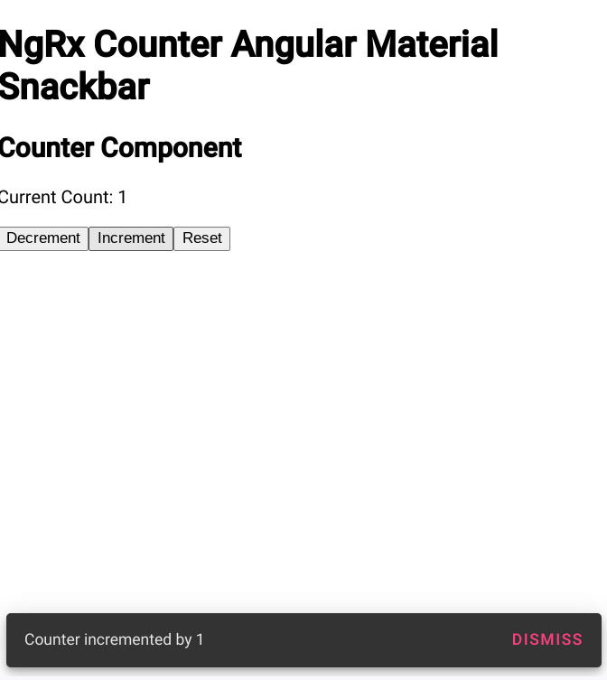

# Ngrx Counter Am Snackbar

NgRx Counter with Angular Material Snackbar

This application is inspired by this [article](https://ackarim.medium.com/how-to-manage-your-notifications-in-angular-ngrx-inside-effects-as-a-side-actions-6cc09ec44646). 

## Screenshots

***

***

## Built With

- [Angular](https://angular.io)
- [Angular CLI](https://github.com/angular/angular-cli) version 16.2.5.
- [Angular Material](https://material.angular.io)
- [NgRx](https://ngrx.io)

## Thoughts

- Few (current) examples of ngrx effects with an Angular Material SnackBar.
- The [original repo](https://github.com/ackuser/angular-ngrx-ngx-toastr) used ngx toastr and a ngrx global store. 
- There are no actions in a component store so I am unsure how I would convert this to use a component store instead.   
- There was some duplication in effects to take advantage of toastr's different snackbar types. 
- To emulate different snackbar types in Angular Material pass different components to snackBar.openFromComponent() ?
- I had problems with the MatSnackBar provider when I changed from module to standalone so I reverted back to modules. 
- I converted to use action groups versus separate actions.

## Continued Development

- Module to Standalone

## Useful Resources

- [Medium](https://ackarim.medium.com/how-to-manage-your-notifications-in-angular-ngrx-inside-effects-as-a-side-actions-6cc09ec44646) - how to manage your notifications in angular ngrx inside effects as side actions
- [Github](https://github.com/chandru415/angular-ngrx-material-snackbar) - angular ngrx material snackbar
- [Github](https://github.com/ackuser/angular-ngrx-ngx-toastr) - angular ngrx ngx toastr
- [Stack Blitz](https://stackblitz.com/edit/angular-ngrx-ngx-toastr?file=README.md) - angular ngrx ngx toastr
- [Blog](https://brianflove.com/2018-03-16/ngrx-mat-snackbar/) - ngrx mat snackbar
- [YouTube](https://www.youtube.com/watch?v=ONENxWh9RHY) - NGRX/Effects - Display snack bar material UI Notifications | Dispatch multiple actions from effects
- [Dev.to](https://dev.to/ngrx/announcing-ngrx-v15-standalone-apis-type-safe-projectors-component-and-componentstore-updates-and-more-l7) - ngrx standalone apis
- [Stack Blitz](https://stackblitz.com/edit/angular-ngrx-component-store?file=src%2Fapp%2Fapp.module.ts) - angular ngrx component store
- [Medium](https://blog.herodevs.com/component-store-101-main-concepts-and-ngrx-store-interactions-45645c46b1e4) - component store 101 main concepts and ngrx store interactions
- [Stack Blitz](https://stackblitz.com/edit/angular-material-consecutive-snackbars-canwzv?file=src%2Fapp%2Fapp.component.ts) - angular material consecutive snackbars
- [Blog](https://timdeschryver.dev/blog/start-using-ngrx-effects-for-this#handling-the-flow-of-a-a-classmark-mark-hover-hrefhttps-materialangulario-components-dialog-overview-relexternal-data-with-favicon-style--favicon--urlhttps---v1indieweb-avatar11tydev-https3a2f2fmaterialangularioangular-material-a-dialog) - start using ngrx effects for this
- [This is Angular](https://this-is-angular.github.io/ngrx-essentials-course/docs/chapter-11/) - ngrx essentials course